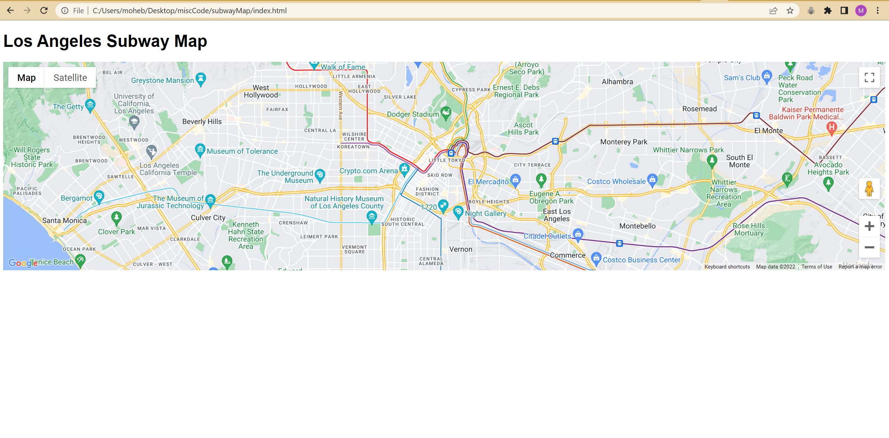

# Los Angeles Subway Map
Los Angeles Transit lines displayed through the use of Google Maps API.

## Setup
 - Download the source folder
 - Copy the path of index.html

 Example:
 ```
 C:\Users\moheb\Desktop\miscCode\subwayMap\index.html
 ```
 - Paste the path into your Internet browser.

You should see the following:

 